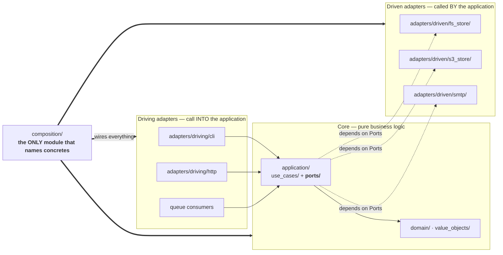

# Service Architecture — Ports, Adapters & Dependency Injection

A project-agnostic guide to structuring an application as a pure core of
business logic surrounded by swappable adapters, assembled in exactly one
place. Written for Python; the principles translate directly to TypeScript,
Rust (traits), Go (interfaces), and C#.

> TEMPLATE: copy this file into a project as its generic service-architecture
> doc, then adapt examples. Verified to contain zero project-specific
> references (grep-checked for a full vocabulary list of the origin project).

---

## 1. When to reach for this pattern

**Reach for it when:**

* An external concern has — or credibly will have — multiple implementations:
  storage backends, payment providers, message queues, notification channels,
  clocks, auth providers, hardware targets.
* You need meaningful tests without network, disk, vendors, or Docker.
* Different parts of the system change on different schedules (UI/API churns,
  core rules evolve slowly, integrations replace constantly).

**Skip it when:**

* It is a script or small library with one implementation of everything and
  no seams worth testing around. Indirection costs more than it buys.

The failure mode to avoid is applying the *ceremony* everywhere instead of the
*architecture* somewhere. See §9.

## 2. The three load-bearing rules

1. **Dependency inversion at true variation points.** Application code depends
   on a port (interface) it owns; adapters depend on the port. The direction
   of source-code dependency always points inward, against the flow of
   runtime control.
2. **Injection everywhere below the composition root.** Services receive
   collaborators through constructor parameters. They never construct their
   own infrastructure, read global config, or import singletons.
3. **Exactly one composition root.** All concrete choices happen in one
   module, driven by configuration. Every other module stays choice-free and
   therefore testable in isolation.

Everything else in this document is elaboration of these three rules.

## 3. The shape



Ports live application-side: `application/ports/`.
Adapters live on the outside: `adapters/driven/<technology>/`.

Dependency arrows point inward only. `domain/` imports nothing from
`adapters/`, `composition/`, frameworks, or vendor SDKs.

## 4. Layer rules (who may import whom)

| Layer | May import | Must never import |
|-------|-----------|-------------------|
| `domain/` (entities, value objects) | stdlib / base utilities | anything else in the project |
| `application/` (use-cases, ports) | its own `domain/` | adapters, composition, vendor SDKs |
| `adapters/driven/<tech>/` | its ports, its domain | other features' adapters |
| `adapters/driving/*` (CLI, HTTP, queues) | application services, ports | domain internals beyond public types |
| `composition/` | everything | — (it is the sanctioned violator) |

**Hard invariant:** the core has no `@inject`, no service locator, no global
container lookup. Core objects receive collaborators through plain constructor
parameters and never learn that a container exists. Wiring is an application
edge concern, not a domain concern.

## 5. Declaring a port

Default form — structural (`typing.Protocol`), runtime-checkable, minimal:

```python
# application/ports/document_store.py
from typing import Protocol, runtime_checkable


@runtime_checkable
class DocumentStore(Protocol):
    """Driven port: persist and retrieve documents by key."""
    def save(self, key: str, payload: bytes) -> str: ...
    def load(self, key: str) -> bytes: ...


# application/ports/clock.py
@runtime_checkable
class Clock(Protocol):
    """Driven port: current time (real wall clock vs frozen test clock)."""
    def now(self) -> datetime: ...
```

Rules:

1. **One port per file**, named after the *role* the core needs
   (`DocumentStore`, `Clock`, `EventPublisher`) — never after the technology
   (`S3Client` is an adapter detail; `ObjectStore` is the port).
2. **Keyword-only parameters** for arguments whose meaning is positional-
   ambiguous (`def submit(self, intent: Intent, *, at: datetime) -> ...`)
   so alternate adapters cannot silently reorder semantics.
3. **Speak your own types.** Port signatures use domain/value types, never
   vendor types. If a foreign object must cross, widen to a neutral type and
   translate inside the adapter at the boundary.
4. `@runtime_checkable` verifies method *presence* only — never signatures.
   Treat it as a cheap smoke check for tests; real conformance is the job of
   a static type checker run in CI.
5. **No logic in ports.** Method bodies are `...`.

### Protocol vs ABC vs plain class

| Choose | When |
|--------|------|
| `Protocol` (default) | Any seam where implementations vary or fakes are needed. Adapters stay free-standing classes; third-party objects conform automatically without importing you. |
| `abc.ABC` | Only when adapters genuinely share behavior through inheritance (template method), or a framework requires nominal registration. Write a docstring note explaining why a Protocol was rejected. |
| Plain class | Single implementation, no foreseeable seam. Do not pre-abstract. |

Why Protocols win as the default in dynamically-typed languages: adapters do
not inherit anything, so legacy objects, third-party clients, and test doubles
conform without modification; the port module stays free of coupling in both
directions; and there is no abstract-method machinery to maintain.

## 6. Implementing an adapter

Adapters **do not inherit the port**. Structural conformance is enforced by
the type checker, not by an `isinstance` gate at construction:

```python
# adapters/driven/fs_store/store.py
from dataclasses import dataclass
from pathlib import Path


@dataclass(slots=True)
class FileSystemStore:
    """Documents on local disk. Structurally implements DocumentStore."""
    root: Path

    def save(self, key: str, payload: bytes) -> str:
        path = self.root / key
        path.parent.mkdir(parents=True, exist_ok=True)
        path.write_bytes(payload)
        return str(path)

    def load(self, key: str) -> bytes:
        return (self.root / key).read_bytes()
```

Conventions:

1. Plain or slots dataclasses for stateless / simple-state adapters;
   explicit `__init__` only when construction has real validation logic.
2. Vendor translation lives in the adapter. Vendor exception types are caught
   here and re-raised as your own error types before they cross the port.
3. An adapter may expose extra methods beyond the port. Consumers needing
   those take the concrete type at the composition root — never widen the
   port to fit one adapter's extras.
4. Driving adapters (CLI, HTTP handlers, queue consumers) follow the mirror
   image: they call use-cases through thin boundaries and contain no business
   rules of their own.

## 7. The composition root

All concrete choices in one place. Two acceptable forms — pick one and stay
consistent:

### Option A — hand-rolled (fine up to ~20 services)

```python
# composition/app.py
def compose(cfg: Config) -> App:
    store: DocumentStore
    if storage_key(cfg) == "s3":
        store = S3Store(bucket=cfg.bucket, prefix=cfg.prefix)
    else:
        store = FileSystemStore(root=cfg.data_dir)

    reporting = GenerateReport(store=store, clock=SystemClock())
    api = ApiApp(reporting=reporting, token=cfg.api_token)
    return App(reporting=reporting, api=api)


def storage_key(cfg: Config) -> str:
    return "s3" if cfg.s3_enabled else "filesystem"
```

### Option B — declarative DI container (when the graph gets large)

Container libraries give you four primitives; map every registration to one:

| Primitive | Use for |
|-----------|---------|
| Factory    | Per-call objects: request handlers, commands, jobs. |
| Singleton  | Process-wide state: caches, session registries. |
| Resource   | Lifecycle-managed externals: connections, loggers — open on first use, closed deterministically (generator + `finally`). |
| Selector   | The adapter switch (below), keyed off config. |

The adapter-switch idiom — selection logic lives in a *pure function*, so it
is unit-testable with no container involved:

```python
store = providers.Selector(
    providers.Callable(storage_key, config),
    filesystem=providers.Factory(FileSystemStore, root=config.data_dir),
    s3=providers.Factory(S3Store, bucket=config.bucket),
)
```

Whichever form you choose:

* Nested/subsystems receive what they need as `Dependency()`-style inputs and
  stay ignorant of where values originate.
* Configuration enters once, at the top; raw dicts do not wander the graph.
* Adding adapter N+1 costs: implement against the port → add one factory /
  branch → add one selector arm or `if`. Nothing else in the codebase changes.
  That is the entire payoff — protect it ruthlessly.

## 8. Testing the seams

The architecture exists mostly so these tests are possible:

1. **Override providers; never patch imports.**
   Container form:
   ```python
   with container.store.override(MemoryStore()):
       app.reporting.run("weekly")
   ```
   Hand-rolled form: `compose()` accepts optional overrides, or tests build
   the graph directly with fakes. `monkeypatch.setattr` on module globals is
   banned for wiring tests — it hides the seams the design provides.

2. **Fakes are bare classes conforming to the port** — no inheritance, no
   mocking framework:
   ```python
   @dataclass
   class MemoryStore:
       blobs: dict[str, bytes] = field(default_factory=dict)
       def save(self, key: str, payload: bytes) -> str:
           self.blobs[key] = payload
           return key
       def load(self, key: str) -> bytes:
           return self.blobs[key]


   @dataclass(frozen=True)
   class FrozenClock:
       ts: datetime
       def now(self) -> datetime:
           return self.ts
   ```

3. **Test in tiers:** unit tests inject fakes into use-cases directly;
   composition tests build the real graph and assert the right concretes got
   selected for a given config; end-to-end tests exercise driving adapter →
   core → fake-driven adapters.

## 9. When NOT to introduce an abstraction

Over-abstraction kills more codebases than under-abstraction. Guardrails:

* **Two implementations or it didn't happen.** A port with one adapter and no
  credible second is speculation. Keep the concrete class and inject it
  directly; extracting later is mechanical precisely because injection is
  already in place.
* **Do not mirror vendor APIs as ports.** Ports model *your* roles
  (`DocumentStore`), not SDK surfaces (`Boto3Wrapper`). Translation belongs in
  the driven adapter.
* **No pass-through interfaces.** If the port just re-declares the delegate's
  methods one-for-one, delete it — it adds indirection and nothing else.
* **Config is not a hidden dependency.** Pass typed config values explicitly;
  only lifecycle-managed externals go through the container.
* **Pure functions take no container and no ports.** Algorithms, parsers, and
  math receive inputs and return outputs. Injecting into computation is
  ceremony, not architecture.

Rule of thumb: the number of ports should track the number of *external
boundaries* (storage, transport, time, identity, third parties) — typically
five to fifteen for a mid-sized service — not the number of classes.

## 10. New-project checklist

Starting from an empty repository:

1. Create the layer skeleton: `domain/`, `application/ports/`,
   `application/use_cases/`, `adapters/driving/`, `adapters/driven/`,
   `composition/`.
2. Enforce §4 import rules in CI (import-linter / dependency-cruiser /
   archunit equivalent) from day one — retrofitting layer discipline is far
   more expensive than enabling the check early.
3. Write the first use-case with its port signatures and a fake-backed test
   before any real adapter exists.
4. Build the cheapest real adapter (usually in-memory or filesystem) plus the
   composition root that selects it.
5. Add the second adapter only when a real requirement appears; wire it via a
   selector keyed by a pure config function.
6. Wire static type checking strictly: structural conformance replaces
   runtime registration checks.
7. Re-read §9 whenever you are about to create a new port.
