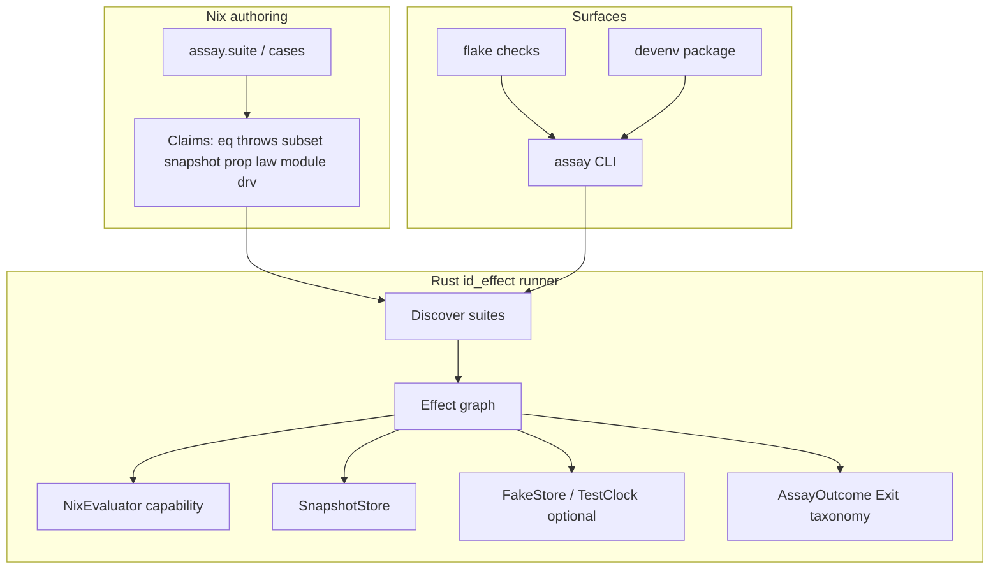
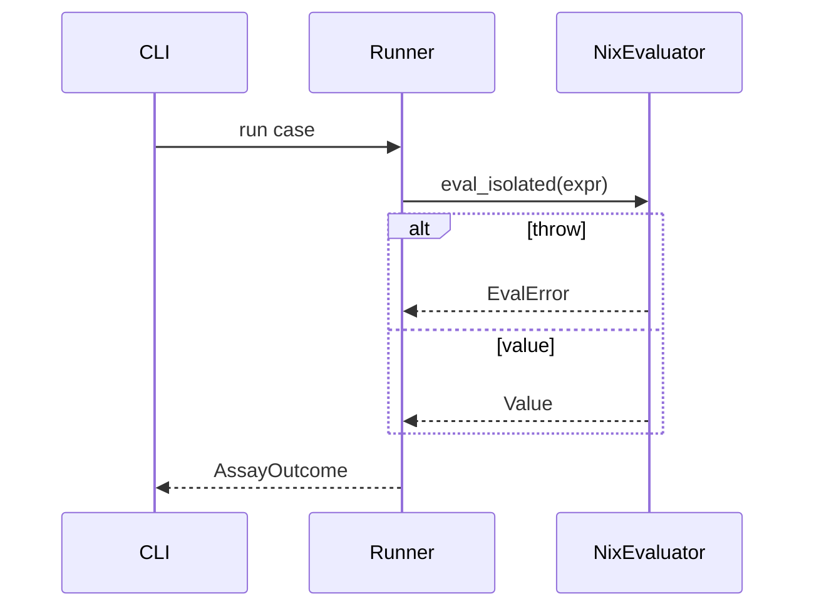

# Assay — Superior Nix unit testing (history)

## 1. Executive summary

**Decision:** Build **Assay** — hybrid framework where **Nix authors claims as values** and a **Rust + `id_effect` runner** evaluates, isolates, diffs, and reports. Pure Nix cannot beat `nix-unit` as a runner (evaluator-API isolation is the hard constraint). Pure equality harnesses (`lib.runTests`, `nixt`, `namaka`, `nix-unit`) are insufficient as a *claim algebra*.

**Doctrine:** Claims are Nix values; outcomes are `id_effect`-style Exits; the evaluator is a capability — never a global.

**This document** is the design-lock + Maestro-ready hierarchical plan. No Assay code is shipped yet. Maestro mission materialization waits on approval (active mission `pln-mpnt1tse-drnl3i` / `dotfiles-excellence` is orthogonal; do not fold Assay into claimed WS-1…WS-6 tasks).

---

## 2. Skills reviewed (this session)

| Skill | Role | Used? |
|-------|------|-------|
| `thinking/first-principles` | Strip inherited Nix-test assumptions | **Primary** |
| `thinking/zwicky-box` | Morphological design space | Yes |
| `thinking/inversion` | Failure modes / anti-goals | Yes |
| `thinking/decision-matrix` | Pure Nix vs hybrid | Yes |
| `rust/id_effect/id_effect-testing` | `run_test`, Exit, DI, laws, goldens | Yes |
| `rust/id_effect/id_effect-schema` | Generators / round-trips | Yes |
| `typescript/effect.ts-testing` | Effect-world patterns to port | Context |
| `.cursor/skills/maestro/SKILL.md` | Repo Maestro conventions | Yes |
| `~/.claude/skills/maestro-design` | Spec grill before mission | Deferred to approval |
| `~/.claude/skills/maestro-mission` | Heavy decompose / waves | Plan structure |
| `~/.claude/skills/maestro-task` | Leaf = 1 PR | Plan structure |
| `~/.claude/skills/maestro-verify` | Witness / verdict | Gates |
| `~/.claude/skills/maestro-handoff` | Inbox check | Phase 0 |
| `engineering/scrutinize` | Outsider review of this plan | Yes (§11) |
| `science/scientific-method` | Trade-off experiments | Yes (§4) |

---

## 3. Reconnaissance digest

| Finding | Source | Implication |
|---------|--------|-------------|
| `history/` exists, empty | explore | Inaugurate `history/<YYYYMMDD-HHMMSS>-<slug>.md` |
| Specs live under `docs/specs/` (not `.maestro/specs/`) | excellence spec + tasks.jsonl | Follow repo convention |
| `.maestro/MAESTRO.md` missing | explore | Do not block Assay; WS-1b separate |
| `nix-unit` / `namaka` / `nixt` in devenv; **zero in-repo usage** | devenv.nix:75–77 | Additive; no migration debt |
| `common/assert.nix` = config asserts only | common/assert.nix | Coexist; not a competitor |
| Rust pattern = `rust/tools/<name>/` | rust/Cargo.toml, oomkiller | Runner: `rust/tools/assay/` |
| `id_effect` **not** a workspace dep | TESTING.md examples only | Runner leaf must add dep deliberately |
| Active mission: excellence WS claimed ×10 | maestro_task_list | Separate `pln-` for Assay |
| Soft touch: CI workflows, quality_gates | .github/workflows, config.yaml | Wave-final leaf only |
| `maestro intake` unavailable | CLI unknown | Lane judged manually → **heavy / high-risk** |

---

## 4. First principles (locked)

### Problem statement

When done: authors write Nix claims; CI/local runner returns a structured Pass/Fail taxonomy including eval throws, with derivation-safe comparison, optional properties/laws/snapshots, and capability-injected fixtures — without NixOS VM tests for module units.

### Assumption audit

| Claim | Status | Evidence |
|-------|--------|----------|
| `expr`/`expected` equality is enough | **reject** | Loses throws, partial structure, laws |
| Pure Nix can isolate per-test throws | **false** | Needs evaluator API |
| Deep-compare derivations is fine | **false** | nix-unit FAQ: stack overflow |
| Snapshots XOR assertions | **reject** | Need both in one algebra |
| Unit ⇒ no store | **soften** | Uncontrolled store forbidden; sandboxed OK |
| Must rewrite tests in Rust | **false** | Authoring stays Nix |

### Base constraints

1. Eval failure is a first-class outcome (throw / recursion / timeout).
2. Compare **normalized projections**, never raw deepForce of derivations.
3. Laziness is semantic — force-set can be part of a claim.
4. Runner needs native evaluator access for isolation + speed.
5. Fixtures (store, NIX_PATH, clock, IFD FS) are capabilities at the edge.
6. Flake `checks` / devenv remain the integration surface.

### Scientific trade-offs (falsify first)

| Hypothesis | Falsification experiment | Default if wrong |
|------------|--------------------------|------------------|
| H1: Nix C API isolation enough for v0 | Spike: 50 throw + 50 eq; wall < 500ms; no cross-case leak | Process-pool fallback |
| H2: Normalization removes drv footgun | `pkgs.hello` path compares must not overflow | Ban drv in `eq`; require `assay.drv` |
| H3: Authors accept claim algebra | Dogfood ≥10 real common/features tests | Keep runTests-compat indefinitely |

---

## 5. Decision log (locked)

| # | Decision | Default | Delta if wrong |
|---|----------|---------|----------------|
| D1 | Hybrid: Nix DSL + Rust/`id_effect` runner | Hybrid | Pure Nix cannot catch throws well |
| D2 | Product name **Assay** | Assay | Rename only |
| D3 | Runner at `rust/tools/assay/` | That path | Feature module if host install needed |
| D4 | Nix DSL at `common/assay/` | `common/assay/` | Move under features/ if host-facing |
| D5 | Evaluator v0 = Nix C API; tvix later | Nix C API | Alternate capability |
| D6 | Compat with nix-unit / runTests shape in v0 | Compat on | Drop after migration |
| D7 | Absorb namaka UX into algebra | Absorb | Keep namaka external only |
| D8 | Separate Maestro mission (not excellence WS-7) | Separate `pln-` | Merge only if excellence closes |
| D9 | No implementation until approval + grill | Gate | — |

### Anti-goals

- Must not require writing Nix-library tests in Rust.
- Must not require NixOS VM for module unit claims.
- Must not treat `true` as the result type.
- Must not deep-compare derivations by default.
- Must not mock nixpkgs via global overlay in tests.
- Must not ignore nix-unit attr shape on day one.

---

## 6. Target architecture



### Claim algebra (v1+)

| Claim | Meaning |
|-------|---------|
| `eq a b` | Normalized structural equality |
| `subset` / `hasAttrs` | Partial structure |
| `throws pattern` | Classified eval failure |
| `forces paths` | Only listed attrpaths forced |
| `snapshot name` | Golden + update UX |
| `prop generators P` | Property + shrink + seed |
| `law {…}` | Algebraic laws (cf. `law_test!`) |
| `module {…}` | `lib.evalModules` + config predicates |
| `drv { project = … }` | Derivation projection before compare |

### Outcome taxonomy

```text
Pass
Fail { claim, left, right, diff }
EvalError { kind, message, span }
Recursion
Timeout
Counterexample { seed, shrunk }
SnapshotMismatch { path, diff }
ResourceLeak
```

### Normalization pipeline (always before `eq`)

1. Derivations → `{ type = "derivation"; outPath; name }` (configurable)
2. Paths → store-relative or content hash
3. Functions → refuse unless opt-in `toString`
4. Depth/size budgets → hard fail instead of stack overflow

---

## 7. Hierarchical decomposition

```text
Epic: Assay (nix-assay-testing)
├── Phase 0 — Design lock & specs          [this document]
├── Phase 1 — Runner MVP (nix-unit parity+)
│   ├── leaf-assay-spike-eval-api
│   ├── leaf-assay-runner-core
│   ├── leaf-assay-nix-compat-shape
│   └── leaf-assay-normalize-diff
├── Phase 2 — Claim algebra + goldens
│   ├── leaf-assay-dsl-nix
│   ├── leaf-assay-claims-eq-throws
│   ├── leaf-assay-snapshots
│   └── leaf-assay-module-eval
├── Phase 3 — Laws, properties, coverage
│   ├── leaf-assay-generators-prop
│   ├── leaf-assay-laws
│   └── leaf-assay-force-coverage
├── Phase 4 — Capabilities & packaging
│   ├── leaf-assay-capabilities-sandbox
│   ├── leaf-assay-devenv-flake
│   └── leaf-assay-ci-gate
└── Phase 5 — Dogfood & docs
    ├── leaf-assay-dogfood-common
    └── leaf-assay-docs-readme
```

### Execution waves (post-materialization)

| Wave | Tasks (slug) | Parallel? | Blocked by |
|------|--------------|-----------|------------|
| 0 | leaf-assay-spike-eval-api | no | — |
| 1 | leaf-assay-runner-core, leaf-assay-nix-compat-shape | yes | wave 0 |
| 2 | leaf-assay-normalize-diff | no | wave 1 |
| 3 | leaf-assay-dsl-nix, leaf-assay-claims-eq-throws | yes | wave 2 |
| 4 | leaf-assay-snapshots, leaf-assay-module-eval | yes | wave 3 |
| 5 | leaf-assay-generators-prop, leaf-assay-laws, leaf-assay-force-coverage | yes | wave 4 |
| 6 | leaf-assay-capabilities-sandbox | no | wave 5 |
| 7 | leaf-assay-devenv-flake, leaf-assay-ci-gate | yes | wave 6 |
| 8 | leaf-assay-dogfood-common, leaf-assay-docs-readme | yes | wave 7 |

**Rule:** Never claim wave N+1 until wave N tasks are `shipped`.


---

## 8. Leaves (full detail)

### leaf-assay-spike-eval-api

**Context.** Prove H1: isolated eval + throw catch via Nix C API from Rust. Skip → sandcastle.  
**Current:** no assay crate; devenv has nix-unit binary only.  
**Target:** spike in `rust/tools/assay` returning Pass/EvalError for fixtures.  
**Deps:** none. **Wave:** 0.

**AC**

1. Given Nix expr that throws, When eval'd in isolation, Then `EvalError` and next case still runs.
2. Given 50 throw + 50 success cases, When suite runs, Then wall < 500ms (document measured).
3. Given two cases, When first blackholes, Then second not polluted.

**Files**

- Create: `rust/tools/assay/**`, `rust/tools/assay/SPIKE.md`
- Modify: `rust/Cargo.toml` (member); `rust/workspace.toml` if still authoritative
- Contract: `rust/tools/assay/**`, `rust/Cargo.toml`

**Diagram**



**Gates**

| Gate | Command | Pass | Witness |
|------|---------|------|---------|
| Unit | `cd rust && cargo test -p assay` | 0 fail | agent-claimed-locally |
| Spike note | SPIKE.md has timings | present | agent-claimed-locally |
| Maestro verify | `maestro task verify <tsk>` | exit 0 | witnessed-by-maestro |

**Notes.** Prefer evaluator bindings; do not reimplement Nix. Fail spike → process-pool (document in SPIKE.md).  
**Risks.** FFI complexity (H); rollback = delete spike crate.

---

### leaf-assay-runner-core

**Context.** `id_effect` orchestration: discover → schedule → `run_test` → Exit.  
**Deps:** spike. **Wave:** 1 (parallel with compat).

**AC**

1. Library API + CLI `assay run <path>`.
2. Uses `run_test` (or documented equivalent) with leak detection.
3. Outcome taxonomy (§6) as JSON for CI.

**Files:** `rust/tools/assay/src/{lib,main,outcome,discover}.rs`; add `id_effect` dep (path/crates.io — decide in PR).

**Gates:** `cargo test -p assay`, `cargo clippy -p assay -- -D warnings`, maestro verify.

**Risks.** id_effect version skew (M) — pin in Cargo.toml.

---

### leaf-assay-nix-compat-shape

**Context.** Drop-in mental model / nix-unit migration. **Wave:** 1.

**AC**

1. Accepts `{ testName = { expr; expected; }; }` like runTests/nix-unit.
2. Documents mapping to internal `eq`.
3. ≥5 fixtures under `rust/tools/assay/fixtures/compat/`.

**Files:** `src/compat.rs`, fixtures, README section.

**Gates:** cargo test compat; maestro verify.

---

### leaf-assay-normalize-diff

**Context.** Kill derivation footgun; structural diffs. **Wave:** 2.

**AC**

1. Default `eq` on derivation-like values uses projection; no stack overflow.
2. Diff shows attrpath-level structural delta.
3. Size/depth budget exceeded → `Fail` with clear message.

**Files:** `src/{normalize,diff}.rs`; regression `derivation_eq_does_not_overflow`.

**Gates:** cargo test; maestro verify.

---

### leaf-assay-dsl-nix

**Context.** Author-facing Nix library. **Wave:** 3.

**AC**

1. `common/assay/default.nix` exports `suite`, `eq`, `throws`.
2. `nix eval -f common/assay/default.nix` succeeds.
3. Documented import path.

**Files:** `common/assay/default.nix`, `common/assay/README.md`.

**Gates:** nix eval; treefmt; maestro verify.

---

### leaf-assay-claims-eq-throws

**Context.** Claims beyond equality. **Wave:** 3.

**AC**

1. `throws` classifies TypeError vs generic (best-effort pattern).
2. `subset` / `hasAttrs` pass fixtures.
3. Wrong throw pattern → Fail not Pass.

**Files:** claim interpreter + DSL constructors + fixtures.

**Gates:** cargo test; nix eval; maestro verify.

---

### leaf-assay-snapshots

**Context.** Absorb namaka UX. **Wave:** 4.

**AC**

1. `assay.snapshot` reads/writes goldens.
2. Update mode (`--update-snapshots` or env).
3. Mismatch → `SnapshotMismatch` + structural diff.

**Files:** SnapshotStore capability; `testdata/goldens/`.

**Gates:** cargo test; maestro verify.

---

### leaf-assay-module-eval

**Context.** Module units without NixOS VM. **Wave:** 4.

**AC**

1. `assay.module { imports; args; expect }` via `lib.evalModules`.
2. Tiny options fixture (not a full host).
3. Failure shows config attrpath diff.

**Files:** claim type + `fixtures/modules/`.

**Gates:** cargo test; maestro verify.

**Risks.** nixpkgs `lib` coupling (M) — pin input in tests.

---

### leaf-assay-generators-prop

**Context.** Property testing. **Wave:** 5.

**AC**

1. Generators for attrs/lists/strings/bools with size bounds.
2. Counterexample includes seed + shrunk value.
3. Same seed → same counterexample.

**Files:** `src/prop.rs`.

**Gates:** cargo test; maestro verify.

---

### leaf-assay-laws

**Context.** Algebraic laws for Nix combinators. **Wave:** 5.

**AC**

1. ≥3 laws for `//` or `mapAttrs`-style helpers.
2. Failure prints law name + counterexample.
3. Docs: how to add a law.

**Gates:** cargo test; maestro verify.

---

### leaf-assay-force-coverage

**Context.** Lazy-force claims — differentiator. **Wave:** 5.

**AC**

1. Best-effort forced-attrpath report after eval (document limits).
2. `forces` claim fails on unexpected paths.
3. If evaluator cannot expose force set: ship probe API + explicit UNSUPPORTED; **do not fake**; CI must not require it.

**Gates:** cargo test or documented skip with evidence; maestro verify.

**Risks.** Evaluator-limited (H) — falsify early; optional feature.

---

### leaf-assay-capabilities-sandbox

**Context.** DI fixtures. **Wave:** 6.

**AC**

1. Caps: `NixEvaluator`, `SnapshotStore`, optional `FakeStore`, `TestClock`.
2. Inject via provide/env — no unrestored global `NIX_PATH` mutation.
3. IFD denied unless FakeStore provided.

**Files:** `src/caps.rs`; `mock_capability!` / `provide!` patterns.

**Gates:** cargo test; maestro verify.

---

### leaf-assay-devenv-flake

**Context.** Expose tool. **Wave:** 7.

**AC**

1. `devenv.nix` packages include `assay`.
2. Flake `checks.<system>.assay` runs fixture/dogfood suite.
3. README documents `assay run`.

**Files:** `devenv.nix`, `flake.nix`, `README.md`.

**Gates:** nix flake check (or dry-run of check attr); treefmt; maestro verify.

**Coordination:** CI/README vs excellence WS-1c / WS-4.

---

### leaf-assay-ci-gate

**Context.** Quality gate. **Wave:** 7.

**AC**

1. `.maestro/config.yaml` quality_gates gains assay command.
2. GitHub workflow job (pr + main) runs assay suite.
3. Failure fails the job.

**Files:** `.maestro/config.yaml`, `.github/workflows/{pr,main}.yml`.

**Gates:** CI green on PR; maestro verify; evidence_record.

---

### leaf-assay-dogfood-common

**Context.** Real repo value. **Wave:** 8.

**AC**

1. ≥10 Assay cases covering `common/assert.nix` + ≥1 small feature pure fn.
2. Cases under `common/assay/tests/` or `tests/assay/`.
3. All Pass under `assay run`.

**Gates:** assay run; flake check; maestro verify.

---

### leaf-assay-docs-readme

**Context.** Operability. **Wave:** 8.

**AC**

1. README: why Assay vs nix-unit/namaka/nixt.
2. `common/assay/README.md` + `rust/tools/assay/README.md` complete.
3. Link from `rust/tools/TESTING.md` without falsely claiming id_effect is already vendored.

**Gates:** links resolve; maestro verify; ship.

---

## 9. Plan-level rollup

### Recommended order

1. Spike eval API (H1 gate)  
2. Runner + compat (parallel)  
3. Normalize/diff  
4. DSL + eq/throws  
5. Snapshots + module  
6. Prop + laws + force (force may UNSUPPORTED)  
7. Sandbox → packaging + CI  
8. Dogfood + docs  

### Parallelism map

- Waves 1, 3, 4, 5, 7, 8: multi-subagent eligible  
- Waves 0, 2, 6: sequential  

### Total quality gate (epic)

```bash
devenv shell -- bash -lc '
  cd rust && cargo test -p assay && cargo clippy -p assay --all-targets -- -D warnings
  assay run common/assay/tests
  nix flake check
'
```

### Out of scope / deferred

- NixOS VM / `nixosTest` integration  
- Full tvix backend  
- Watch mode inside Assay  
- Immediately removing devenv nix-unit/namaka/nixt packages  
- Folding into `pln-mpnt1tse-drnl3i`  

### Maestro artifacts (after approval)

| Artifact | Path / id |
|----------|-----------|
| History (this file) | `history/20260803-232133-nix-assay-testing.md` |
| Spec (grill) | `docs/specs/nix-assay-testing.md` |
| Mission | `maestro_mission_from_spec` → `pln-…` |
| Execution overlay | `.maestro/missions/nix-assay-testing.execution.md` |
| Cursor plan (optional mirror) | `.cursor/plans/nix-assay-testing.plan.md` |

---

## 10. Phase 0 Maestro bootstrap (session evidence)

| Check | Result |
|-------|--------|
| `maestro_setup_check` | ok |
| `maestro_handoff_list` | 10 unpicked excellence claim envelopes — **not picked up** (Assay separate) |
| draft / blocked | 0 / 0 |
| claimed | 10 (excellence) — do not claim for Assay |
| `maestro intake` | **N/A** (CLI unknown) |
| Lane | **heavy / high-risk** (manual) |

---

## 11. Scrutinize (outsider pass)

**Intent.** Design-lock a plan for a Nix test framework that surpasses existing tools via hybrid architecture.

**Simpler alternative.** “Just use nix-unit + namaka better” — rejected as epic end-state; accepted as **v0 compat substrate** (D6/D7). History without mission until grill — correct.

**Trace**

- `rust/tools/assay/` matches oomkiller layout — holds.
- Spec under `docs/specs/` matches excellence — holds.
- Force-coverage may be impossible — called out; must not fake — holds.
- id_effect absent — runner leaf must add dep — holds.

**Findings**

1. **Major — force coverage may be vapor.** Evaluator may not expose thunk force sets. Keep leaf; allow UNSUPPORTED; do not CI-gate.
2. **Major — FFI spike is SPOF.** Entire epic depends on H1. Wave 0 hard gate before DSL.
3. **Nit — excellence handoffs stale** (2026-05-27). Not Assay-blocking.

**Verdict:** **fix-then-ship (as plan)** — accept this history as design lock; before Maestro materialization, grill spec with H1 spike AC + force-coverage contingency.

---

## 12. Approval gate

Reply **approve** (or request edits) to:

1. Grill → `docs/specs/nix-assay-testing.md` (`mode: heavy`)
2. `maestro_mission_from_spec` + decompose leaves in §8
3. Write `.maestro/missions/nix-assay-testing.execution.md` wave table
4. Begin wave 0 (`leaf-assay-spike-eval-api`) only

Until then: **no Assay implementation commits.**
