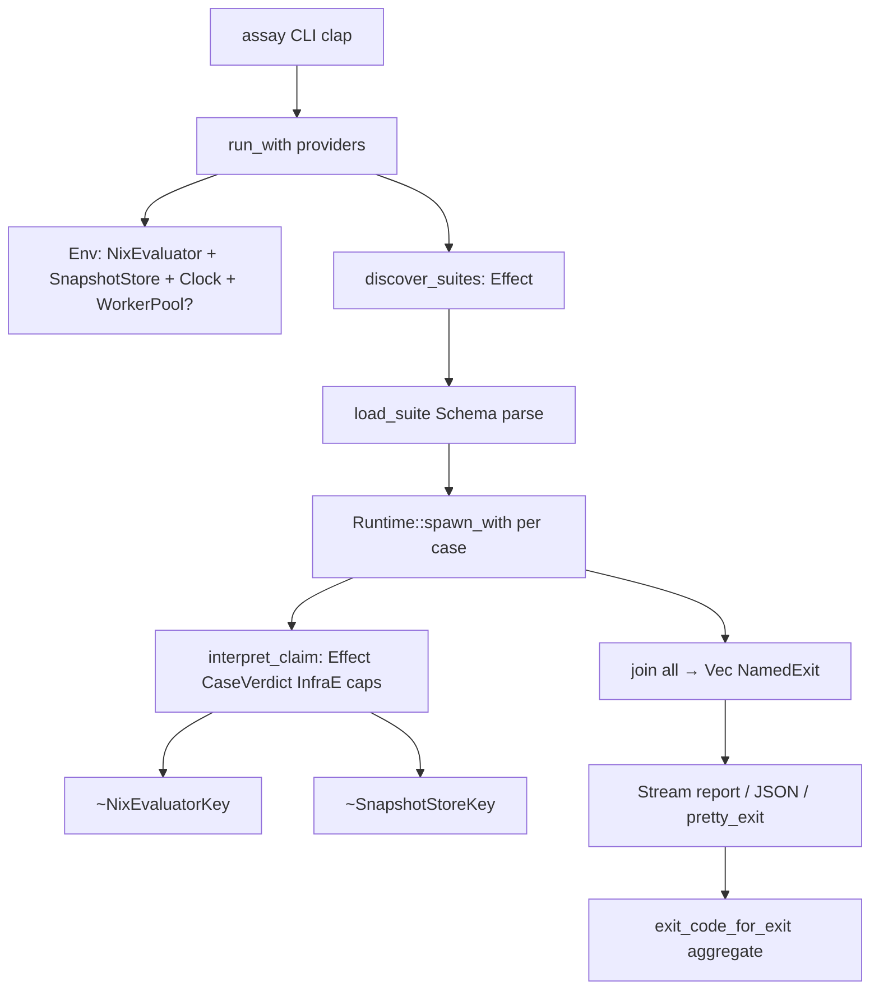

# Assay × id_effect — Reimplementation Plan

## 0. Skills reviewed

| Skill | Role |
|-------|------|
| `rust/id_effect/SKILL.md` | Router — Effect/caps/parallelism doctrine |
| `id_effect-fundamentals` | `Effect<A,E,R>`, `effect!`, `~` |
| `id_effect-capabilities` | `caps!`, `provide!`, `build_env`, `run_with` |
| `id_effect-errors` | `Exit` / `Cause` / recovery |
| `id_effect-concurrency` | Fibers, scopes, Schedule |
| `id_effect-streams` | Stream/Sink, `map_par_n`, Parallelism |
| `id_effect-testing` | `run_test`, `mock_capability!`, laws, goldens |
| `id_effect-schema` | Claim/suite parsing as Schema |
| `id_effect-optics` | JSON subset / attr walks |
| `id_effect-platform` | Process/FS behind platform traits |
| `id_effect-resilience` | Retry/backoff for flaky eval |
| `thinking/first-principles` | Constraint extraction |
| `engineering/scrutinize` | Outsider pass (§9) |

**Book anchors:** Part II ch05–07 (DI), Part III ch08–11 (Exit/fibers/scopes/schedule), Part IV ch13–15 (streams/schema/testing), Part V ch18/24 (optics/laws).

---

## 1. Executive doctrine

> **Library code returns `Effect`. Capabilities are the only I/O. Cases run as fibers. Outcomes are `Exit`. The CLI is a thin `run_with` edge.**

Current Assay proves the *product* (compat + smoke + dogfood green). It does **not** yet use id_effect. This plan replaces the sync runner with an Effect-native architecture that exploits Runtime, Fiber, DI 3.0, TestClock, Schedule, Streams, Schema, Optics, and `id_effect_process` — without regressing the green suites.

---

## 2. Gap (as-built → target)

```
As-built:  Nix claims → sync Rust → Command::nix → AssayOutcome ADT → clap ExitCode
Target:    Nix claims → Effect graph → caps!(NixEval,…) → Exit<CaseVerdict, InfraE>
           → fibers + scopes → Stream report → id_effect_cli exit codes
```

| Concern | Today | Target |
|---------|-------|--------|
| Dep | none | path `id_effect` (+ macro, cli, process, platform, optics) |
| Case run | `catch_unwind` | `run_test` / `run_blocking` at edge only |
| Eval | hardcoded `ProcessNixEval` | `caps!(NixEvaluatorKey)` + Live/Mock providers |
| Parallelism | sequential `map` | `run_fork` per case; collect all `Exit`s |
| Timeout | dead variant | fiber race vs `Clock::sleep` |
| Snapshots | split `caps`/`snapshot`, unused update flag | single `SnapshotStoreKey` + `GoldenBuilder` |
| Mocks | in-module `MockEval` | `mock_capability!` |
| Laws/prop | orphan modules | `law`/`prop` claims + `law_test!` / proptest helpers |
| Parse | ad-hoc JSON | Schema → `Claim` |
| Subset walk | manual recursion | optics Traversal/Optional |
| CLI | `anyhow` | `exit_code_for_exit` |

---

## 3. Locked decisions

| # | Decision | Rationale |
|---|----------|-----------|
| D1 | Path-dep `id_effect` from `/data/Code/rust/id_effect` (workspace git/path later) | Match local development; pin in Cargo.toml comment |
| D2 | **Domain verdict ≠ Cause.** `CaseVerdict::{Pass, AssertFail, …}` is `A` in `Exit<A, InfraError>`. Infra (missing cap, suite I/O, timeout budget) is `Fail(InfraError)`. Panics/leaks are `Die` via `run_test`. | Test runners must report soft assertion failures without treating them as fiber death |
| D3 | Parallel cases with **collect-all**, not fail-fast `fiber_all` | Suites need every case outcome |
| D4 | Keep process-isolated `nix eval` as **Live** provider v1; C API as alternate provider later | SPIKE H1 fallback already proven |
| D5 | Optional `id_effect_process` worker pool behind `NixWorkerPoolKey` for bounded concurrency | Cap concurrent nix processes; timeouts via `Addr::call` |
| D6 | Pure modules stay pure: `normalize`, `diff` — no Effect wrapper | FP: morphisms on values |
| D7 | No Layer/Stack/`define_capability!` — DI 3.0 only | Skill router |
| D8 | Preserve CLI + fixture UX; green suites are regression gates every wave | Product continuity |

### Anti-goals

- Must not put `run_blocking` inside library modules.
- Must not mock by replacing modules.
- Must not deep-compare derivations (keep normalize pipeline).
- Must not race the excellence/Serena leftover tree in the same PR waves.

## 4. Target architecture



### Effect signatures (canonical)

```rust
enum InfraError {
  SuiteLoad(String),
  Capability(String),
  Timeout { case: String, limit_ms: u64 },
  Worker(String),
  Io(String),
}

enum CaseVerdict {
  Pass,
  AssertFail { claim: String, left: Option<Value>, right: Option<Value>, diff: String },
  EvalThrow { kind: String, message: String },
  ExpectedThrow,
  SnapshotMismatch { path: String, diff: String },
  Counterexample { seed: u64, shrunk: Value },
  Unsupported { feature: String },
}

type AssayEnv = caps!(NixEvaluatorKey, SnapshotStoreKey, ClockKey);

fn interpret_claim(claim: Claim) -> Effect<CaseVerdict, InfraError, AssayEnv>;
fn run_suite(path: PathBuf, opts: RunOptions) -> Effect<SuiteReport, InfraError, AssayEnv>;

struct SuiteReport {
  outcomes: Vec<(String, Exit<CaseVerdict, InfraError>)>,
}
```

### Capability keys

| Key | Service | Live | Test |
|-----|---------|------|------|
| `NixEvaluatorKey` | `Arc<dyn NixEval>` | `ProcessNixEvalLive` | `mock_capability!(MockNixEval, …)` |
| `SnapshotStoreKey` | golden FS + update | `FsSnapshotStore` | temp-dir mock |
| `ClockKey` | `Arc<dyn Clock>` | `LiveClock` | `TestClock` |
| `NixWorkerPoolKey` *(wave 3)* | bounded process workers | `ProcessPoolLive` | fake pool |

`EvalFail::{Throw, Recursion, NixMissing}` maps into `CaseVerdict` or `InfraError` depending on claim kind (`throws` vs `eq`).

### Concurrency model

```rust
effect!(|r| {
  let cases = ~load_cases(path);
  let rt = ThreadSleepRuntime::default();
  let handles: Vec<_> = cases.into_iter().map(|(name, claim)| {
    let env = r.clone();
    (name, run_fork(&rt, move || (interpret_claim(claim), env)))
  }).collect();

  let mut outcomes = Vec::new();
  for (name, h) in handles {
    let exit = ~h.await_exit();
    outcomes.push((name, exit));
  }
  SuiteReport { outcomes }
})
```

**Timeouts:** race case fiber with `clock.sleep(limit)` via `FiberHandle::or_else`; loser interrupted; winner maps to `InfraError::Timeout` or verdict.

**Scopes:** acquire temp dirs / worker slots with `scoped` / `acquire_release`; `run_test` asserts no leaked fibers/scopes in unit tests.

**Bounded nix:** `NixWorkerPoolKey` semaphore (or process mailbox) so 1000 cases do not spawn 1000 nix processes.

### Functional layers

| Layer | Use |
|-------|-----|
| **Pure** | `normalize_value`, `structural_diff`, `values_equal`, claim algebra helpers |
| **Schema** | `Claim`, `CompatSuite`, `AssaySuite` decode from `Unknown` / JSON |
| **Optics** | subset containment + `hasAttrs` via Optional/Traversal on `Value` |
| **Laws** | `law_test!` for normalize idempotence; merge laws keep/port; Nix `//` laws as suite claims |
| **Streams** | `Stream::from_iter(outcomes).map(format_line)` for TAP/human; optional `map_par_n` for CPU-bound normalize |
| **Schedule** | optional `retry_with_clock` for transient `NixMissing`/busy store |
| **Goldens** | `GoldenBuilder` / `assert_golden_effect` aligned with SnapshotStore |

---

## 5. Hierarchical decomposition

```text
Epic: assay-id-effect
├── Wave 0 — Dependency + compile skeleton
│   └── leaf-ie-deps-skeleton
├── Wave 1 — Errors + DI spine (parallel)
│   ├── leaf-ie-exit-verdict-model
│   ├── leaf-ie-caps-providers
│   └── leaf-ie-eval-as-capability
├── Wave 2 — Effectify interpreter + runner
│   ├── leaf-ie-interpret-effect
│   ├── leaf-ie-run-suite-effect
│   └── leaf-ie-cli-run-with
├── Wave 3 — Fibers, timeouts, pools
│   ├── leaf-ie-parallel-cases
│   ├── leaf-ie-timeout-race
│   └── leaf-ie-worker-pool
├── Wave 4 — Snapshots + TestClock + goldens
│   ├── leaf-ie-snapshot-cap
│   └── leaf-ie-testclock-timeouts
├── Wave 5 — FP enrichment
│   ├── leaf-ie-schema-claims
│   ├── leaf-ie-optics-subset
│   ├── leaf-ie-laws-proptest-wire
│   └── leaf-ie-stream-report
└── Wave 6 — Hardening + docs
    ├── leaf-ie-regression-green
    └── leaf-ie-docs-book-links
```

| Wave | Tasks | Parallel? | Blocked by |
|------|-------|-----------|------------|
| 0 | leaf-ie-deps-skeleton | no | — |
| 1 | exit-verdict, caps-providers, eval-as-capability | yes | 0 |
| 2 | interpret-effect, run-suite-effect, cli-run-with | yes* | 1 |
| 3 | parallel-cases, timeout-race, worker-pool | yes | 2 |
| 4 | snapshot-cap, testclock-timeouts | yes | 2 |
| 5 | schema, optics, laws-proptest, stream-report | yes | 2 |
| 6 | regression-green, docs | yes | 3–5 |

\* Wave 2: interpret before run-suite/cli if API churn; prefer interpret → then parallel run+cli.

## 6. Leaves

### leaf-ie-deps-skeleton

**Context.** Without a compiling `id_effect` edge, nothing else lands.
**AC**
1. `Cargo.toml` depends on `id_effect`, `id_effect_macro`, `id_effect_proc_macro` (path to `/data/Code/rust/id_effect/crates/...`).
2. Optional features: `process` → `id_effect_process`, `cli-exit` → `id_effect_cli`.
3. `cargo test -p assay` still green (may temporarily wrap old APIs).
4. `crate2nix generate` refreshed.

**Files:** `rust/tools/assay/Cargo.toml`, `Cargo.lock`, `Cargo.nix`.
**Gates:** `cargo test -p assay`, `cargo clippy -p assay -- -D warnings` (with `RUSTC_WRAPPER=`).

---

### leaf-ie-exit-verdict-model

**Context.** Split soft verdicts from infra `Cause`.
**AC**
1. Introduce `CaseVerdict` + `InfraError` (+ serde for JSON CLI).
2. Bidirectional adapter: legacy `AssayOutcome` ↔ `Exit<CaseVerdict, InfraError>` during migration.
3. Unit tests: `run_test(succeed(CaseVerdict::Pass), ())` and `Fail(InfraError::Timeout{…})`.
4. `pretty_exit` used in at least one test assertion path.

**Files:** `outcome.rs` → split/`verdict.rs`, tests.

---

### leaf-ie-caps-providers

**Context.** Real DI 3.0.
**AC**
1. `#[capability]` / ProviderSpec for `NixEvaluatorKey`, `SnapshotStoreKey`, `ClockKey`.
2. `AssayEnv = caps!(…)` type alias.
3. `mock_capability!` for Nix + Snapshot; tests use `build_env([provide!(…)])` + `run_test`.
4. Delete in-module `MockEval` from `claims.rs`.

**Files:** `caps.rs` rewrite, provider modules, claim tests.

---

### leaf-ie-eval-as-capability

**Context.** Ban naked `Command::new("nix")` outside Live provider.
**AC**
1. Trait `NixEval: Send + Sync` with `fn eval_json(&self, expr: &str) -> Effect<Value, EvalFail, ()>` **or** sync method called inside `Effect::new`.
2. `ProcessNixEvalLive` is the only process spawner.
3. Suite load nix-eval also goes through capability or shared `nix_eval_file` effect.
4. Integration test (ignored-ok) still proves throw isolation.

**Files:** `eval.rs`, `compat.rs`, `assay_suite.rs`.

---

### leaf-ie-interpret-effect

**Context.** Claim interpreter becomes Effectful.
**AC**
1. `interpret_claim(claim) -> Effect<CaseVerdict, InfraError, AssayEnv>`.
2. Uses `~NixEvaluatorKey` / `~SnapshotStoreKey` inside `effect!`.
3. Pure normalize/diff stay outside Effect where possible.
4. All existing claim unit tests rewritten with `mock_capability!` + `run_test`; match `Exit::`.

**Files:** `claims.rs`, tests.

---

### leaf-ie-run-suite-effect

**Context.** Orchestration as Effect.
**AC**
1. `run_suite` / `discover` return `Effect<_, InfraError, AssayEnv>`.
2. Sequential OK in this leaf; parallelism is wave 3.
3. `update_snapshots` honored via SnapshotStore cap.
4. Compat + Assay suite paths preserved.

**Files:** `run.rs`, `discover.rs`.

---

### leaf-ie-cli-run-with

**Context.** Thin edge.
**AC**
1. `main` builds providers and `run_with`.
2. Aggregate suite `Exit`s → process exit via `id_effect_cli::exit_code_for_exit` (any Die→101, any Infra Fail→1, AssertFail→1, all Pass→0).
3. Human output uses `pretty_cause` on infra failures.
4. No `anyhow` in lib.

**Files:** `main.rs`.

### leaf-ie-parallel-cases

**Context.** Exploit Runtime/Fibers.
**AC**
1. Cases via `run_fork` / `spawn_with`; joins collect **all** outcomes.
2. Deterministic report order (sort by case name).
3. Unit test with MockNixEval proves concurrency (TestClock or barrier).
4. `run_test` suite of N cases shows zero leaked fibers.

**Files:** `run.rs`, tests.

---

### leaf-ie-timeout-race

**Context.** Make `Timeout` real.
**AC**
1. Per-case optional timeout from CLI/`RunOptions`.
2. Race case fiber vs `Clock::sleep`.
3. Tests use `TestClock` + `run_test_with_clock` → `InfraError::Timeout`.
4. Interrupted loser does not leak fibers.

**Files:** `run.rs`, clock wiring, tests.

---

### leaf-ie-worker-pool

**Context.** Bound nix process fan-out.
**AC**
1. `NixWorkerPoolKey` with max concurrency (default = CPU count).
2. Live pool uses subprocess slots; mock records max in-flight ≤ N.
3. Optional: `id_effect_process` Addr mailbox with `call(timeout)`.
4. Document vs plain fiber+semaphore tradeoff in SPIKE.md addendum.

**Files:** new `pool.rs`, providers, SPIKE.md.

---

### leaf-ie-snapshot-cap

**Context.** Unify goldens.
**AC**
1. Single `SnapshotStore` service; delete duplicate types.
2. Snapshot path uses capability; `--update-snapshots` writes via store.
3. Align with `GoldenBuilder` / `assert_golden_effect` for runner self-tests.
4. Existing `testdata/goldens` still works.

**Files:** `snapshot.rs`, `caps.rs`, `claims.rs`.

---

### leaf-ie-testclock-timeouts

**Context.** Finish deterministic time story.
**AC**
1. All timeout/retry tests use `TestClock`, never wall clock.
2. Optional flaky-eval retry via `retry_with_clock(Schedule::recurs(n), …)` behind flag (default off).

---

### leaf-ie-schema-claims

**Context.** Typed parse boundary.
**AC**
1. `Claim` / suite JSON decoded via id_effect Schema (or thin Schema bridge).
2. Property: encode ∘ decode round-trip for claim JSON fixtures.
3. Replace brittle `claim_from_json` match arms with schema combinators where ergonomic.

**Files:** `assay_suite.rs`, `compat.rs`.

---

### leaf-ie-optics-subset

**Context.** FP over JSON.
**AC**
1. `value_contains_subset` / `hasAttrs` via `id_effect_optics` (or Traversal-shaped pure helpers if Value is a poor optic target).
2. Law: subset reflexive; hasAttrs empty list always true.

**Files:** `claims.rs` or `optics_json.rs`.

---

### leaf-ie-laws-proptest-wire

**Context.** Connect orphan FP modules.
**AC**
1. `law` + `prop` claim kinds parsed and executed.
2. Normalize idempotence as `law_test!` or suite claim.
3. `run_builtin_laws` via `assay laws` or suite type.
4. Optional `proptest` feature mirroring id_effect.

**Files:** `laws.rs`, `prop.rs`, `assay_suite.rs`, CLI.

---

### leaf-ie-stream-report

**Context.** Streaming reporter.
**AC**
1. Outcomes through `Stream` to human/JSON/TAP sink.
2. Backpressure policy documented (buffer all vs live print).
3. CLI `--format tap|human|json`.

**Files:** `report.rs`, `main.rs`.

---

### leaf-ie-regression-green

**Context.** Product must not regress.
**AC**
1. `cargo test -p assay` including ignored nix test when nix present.
2. `assay run` compat **17/17**, smoke **12/12**, dogfood **12/12**.
3. Maestro quality gate still `cargo test -p assay`.
4. Evidence in history or `.maestro/runs/`.

---

### leaf-ie-docs-book-links

**Context.** Teach the architecture.
**AC**
1. Update `rust/tools/assay/README.md` with Effect signatures + provider table.
2. Link id_effect book chapters (ch08, ch09, ch15).
3. Update history status; SPIKE.md note C API still optional.
4. Cross-link `.cursor/skills/rust/id_effect`.

## 7. Dependency pin strategy

```toml
# rust/tools/assay/Cargo.toml
[dependencies]
id_effect = { path = "/data/Code/rust/id_effect/crates/id_effect" }
id_effect_macro = { path = "/data/Code/rust/id_effect/crates/id_effect_macro" }
id_effect_proc_macro = { path = "/data/Code/rust/id_effect/crates/id_effect_proc_macro" }
id_effect_cli = { path = "/data/Code/rust/id_effect/crates/id_effect_cli", optional = true }
id_effect_process = { path = "/data/Code/rust/id_effect/crates/id_effect_process", optional = true }
id_effect_optics = { path = "/data/Code/rust/id_effect/crates/id_effect_optics", optional = true }

[features]
default = ["cli-exit"]
cli-exit = ["dep:id_effect_cli"]
process-pool = ["dep:id_effect_process"]
optics = ["dep:id_effect_optics"]
proptest = ["id_effect/proptest"]
```

**Risk:** absolute path breaks other machines → follow-up: relative path / git submodule / `ID_EFFECT_PATH` in devenv.

---

## 8. Verification matrix

| Gate | Command | Witness |
|------|---------|---------|
| Unit | `cd rust && RUSTC_WRAPPER= cargo test -p assay` | agent |
| Clippy | `cargo clippy -p assay --all-targets -- -D warnings` | agent |
| Compat | `assay run tools/assay/fixtures/compat` | agent |
| Smoke | `assay run ../common/assay/tests/smoke.assay.nix` | agent |
| Dogfood | `assay run ../common/assay/tests/dogfood.assay.nix` | agent |
| Leak | tests calling `run_test` on parallel suite | agent |
| Book discipline | no Layer APIs; DI 3.0 only | review |

---

## 9. Scrutinize

**Intent.** Reimplement Assay as an exemplary id_effect citizen while keeping green Nix suites.

**Simpler alternative?** Thin CLI wrapper only — **rejected**: leaves caps/fibers unused.

**Findings**
1. **Major — path dep portability.** Mitigate with relative path or devenv `ID_EFFECT_PATH`.
2. **Major — verdict vs Cause confusion.** Locked in D2; enforce in review.
3. **Major — fiber_all fail-fast wrong for suites.** Use collect-all joins.
4. **Nit — optics on serde_json::Value may be awkward.** Allow Traversal-shaped pure helpers.

**Verdict:** **Ship plan** — wave 0–2 mandatory; 3–5 differentiators; 6 closes the loop.

---

## 10. Approval gate

Reply **approve** to:
1. Grill `docs/specs/assay-id-effect.md` (`mode: heavy`)
2. Materialize Maestro mission + execution overlay
3. Start wave 0 (`leaf-ie-deps-skeleton`)

Until then: no reimplementation commits beyond this plan artifact.
