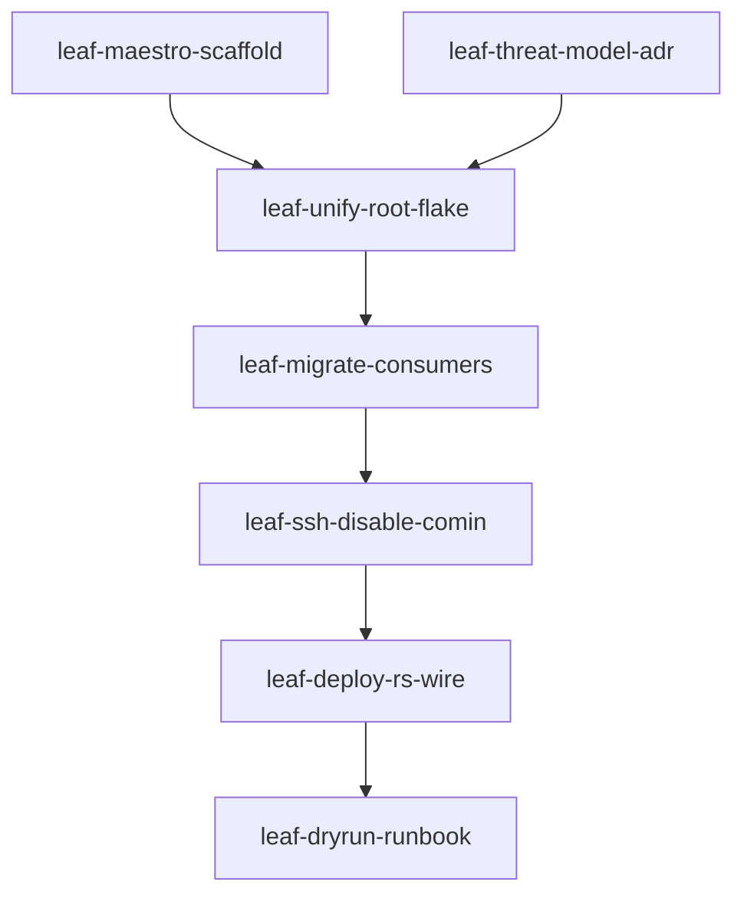

# Multi-Host NixOS Control Plan

**Date:** 2026-08-19  
**Hosts:** Drakkar (desktop), Huginn (tablet), Mimir (file server)  
**Status:** Implemented — waves 0–5 (2026-08-19)  
**Supersedes:** Initial draft sections below marked *archived* or *rejected*

---

## Canonical artifacts (use these for implementation)

| Artifact | Path / id |
|----------|-----------|
| Product spec | `.maestro/specs/multi-host-deploy-rs.md` |
| Maestro mission | `pln-mt0fxitc-f74sm9` |
| Execution overlay | `.maestro/missions/multi-host-deploy-rs.execution.md` |
| Hierarchical plan | `.cursor/plans/multi-host-deploy-rs.plan.md` |
| Plan-check YAML | `.cursor/plans/multi-host-deploy-rs.plan.yaml` |
| Skills | `.cursor/skills/linux/nixos-deploy-rs`, `nixos-managing` |

**Revision log**

| When | What |
|------|------|
| 2026-08-19 ~20:32 | Initial draft: Colmena + deploy-rs hybrid, Hermes-first |
| 2026-08-19 evening | `/plan-hierarchically` + scientific-method; Maestro mission `pln-mt0fxitc-f74sm9` |
| 2026-08-19 ~20:47 | History doc rewritten to match hierarchical plan; obsolete implementation sections removed |

---

## Executive summary (current)

Push-deploy the three-host fleet from a **unified root flake** using **deploy-rs only**. Per-host modules (`disko.nix`, `hardware.nix`, `filesystems.nix`) stay under `hosts/<name>/`. **Comin disabled**. Operator SSH + `bin/fleet`; **Hermes and Colmena out of scope**.


## Observation (scientific baseline)

**Phenomenon:** No single declarative entrypoint for push-deploy across Drakkar, Huginn, Mimir.

**Baseline (verified 2026-08-19):**

- Three independent `hosts/*/flake.nix` + separate `flake.lock` files
- Local updates only: `bin/update/system` → `cd hosts/$(hostname)` → `nixos-rebuild switch --flake ".#$(hostname)"`
- Comin pull-deploy enabled on all hosts via `profiles/base.nix`
- OpenSSH / Tailscale features exist but are **not imported**; firewall allows no ports
- No colmena or deploy-rs in the live tree (planning doc only)

**Success criterion:** From an operator machine with deploy credentials, `deploy .#<host>` (and `deploy .`) activates with magicRollback; `nix flake check` + deployChecks green; `bin/update/host` works against root flake; comin cannot auto-apply.

---

## Hypotheses and verdicts

| # | Hypothesis | Verdict | Notes |
|---|------------|---------|-------|
| H1 | deploy-rs alone suffices for a 3-host fleet | **Accepted** | magicRollback + `activate.nixos`; Colmena deferred |
| H2 | Unified root flake preserves Disko per host | **Accepted** | Modules remain at `hosts/<h>/disko.nix` etc. |
| H3 | Comin must be disabled while push-deploy is primary | **Accepted** | Double-apply races generations |
| H4 | Colmena + deploy-rs hybrid | **Rejected** | Dual activation races; fictional `colmena rollback` in original draft |
| H5 | Hermes-first access plane | **Rejected** | Hermes is software on hosts, not fleet control plane |

---

## Locked decisions

| Topic | Decision | Default if open |
|-------|----------|-----------------|
| Deployer | **deploy-rs only** | Colmena revisit if tags/`deployment.keys` become weekly |
| Flake | **Unified root `flake.nix`** | Host modules unchanged under `hosts/` |
| Comin | **Disable** | — |
| Hermes | **Out of scope** | Fleet CLI under `bin/fleet` |
| Colmena | **Non-goal** | — |
| First remote exercise host | **huginn** | Lower blast than mimir / drakkar |
| SSH network path | Tailscale vs port 22 | **Tailscale preferred** (wave 3) |
| Risk class | **high** | Threat model + rollback evidence required |

---

## Tool comparison (why not Colmena + deploy-rs?)

| Capability | deploy-rs | Colmena |
|------------|-----------|---------|
| magicRollback | Yes | No |
| Uses `nixosConfigurations` | Yes | No (hive evaluates modules) |
| `interactiveSudo` | Yes | Needs non-interactive sudo |
| Parallel multi-host | Via targets | Strong |
| Tags / `deployment.keys` | Weak | Strong |

One primary activator beats dual-tool discipline for three personal hosts.

---

## Hierarchical plan (Maestro)

### Dependency graph



### Wave table

| Wave | Slug | Task id | Parallel? | Blocked by |
|------|------|---------|-----------|------------|
| 0 | leaf-maestro-scaffold | tsk-mt0fxmz9-nxjlmn | yes | — |
| 0 | leaf-threat-model-adr | tsk-mt0fxmz9-nkdmw8 | yes | — |
| 1 | leaf-unify-root-flake | tsk-mt0fxmz9-flb9vs | no | wave 0 |
| 2 | leaf-migrate-consumers | tsk-mt0fxmz9-spvnt4 | no | wave 1 |
| 3 | leaf-ssh-disable-comin | tsk-mt0fxmz9-cek9vh | no | wave 2 |
| 4 | leaf-deploy-rs-wire | tsk-mt0fxmz9-mnhw51 | no | wave 3 |
| 5 | leaf-dryrun-runbook | tsk-mt0fxmz9-fk3sth | no | wave 4 |

Claim: `maestro task claim <tsk> --agent <id> --skip-worktree`. Do not claim wave N+1 until wave N is **shipped**.

### Leaf summaries

**Wave 0 (parallel):** `leaf-maestro-scaffold` — seed `docs/principles/` + `.maestro/MAESTRO.md`. `leaf-threat-model-adr` — ADR + threat model.

**Wave 1:** `leaf-unify-root-flake` — root `flake.nix` + lock; `nixosConfigurations.{drakkar,huginn,mimir}`; preserve `./hosts/<h>/disko.nix`, `filesystems.nix`, `hardware.nix`.

**Wave 2:** `leaf-migrate-consumers` — retarget `bin/update/*`, CI check, notifier, `path:` inputs to repo root.

**Wave 3:** `leaf-ssh-disable-comin` — disable comin; enable OpenSSH (key-only); Tailscale default for mesh.

**Wave 4:** `leaf-deploy-rs-wire` — `deploy.nodes.*`, `deployChecks`, `bin/fleet`, assays; no `colmenaHive`.

**Wave 5:** `leaf-dryrun-runbook` — `deploy .#huginn --dry-activate`; magicRollback drill; `docs/runbooks/fleet-deploy.md`.

Target deploy-rs shape:

```nix
deploy.nodes.drakkar = {
  hostname = "drakkar";
  profiles.system.path =
    deploy-rs.lib.x86_64-linux.activate.nixos self.nixosConfigurations.drakkar;
};
checks = builtins.mapAttrs (_: c: c.deployChecks self.deploy) deploy-rs.lib;
```

### Quality gates

```bash
nix flake check
devenv shell -- assay run .
bin/fleet check huginn && deploy .#huginn --dry-activate  # after SSH ready
maestro task verify <tsk> && maestro verdict request --task <tsk>
```

Full leaf AC, files, and gates: `.cursor/plans/multi-host-deploy-rs.plan.md`.

---

## Reconnaissance digest (2026-08-19)

| Finding | Implication |
|---------|-------------|
| No root flake; 3 host flakes + locks | Wave 1 unification |
| Disko drakkar/mimir; huginn LUKS filesystems | Keep modules under `hosts/` |
| Comin enabled fleet-wide | Wave 3 disable |
| SSH/Tailscale off | Wave 3 unblock remote deploy |
| ~15 scripts use `hosts/$HOST` | Wave 2 migrate |
| `docs/principles/` missing | Wave 0a |

---

## Skills installed during planning

| Skill | Locations |
|-------|-----------|
| `nixos-managing` | `.cursor/skills/linux/`, hermes-agent, `.hermes/`, monorepo `.hermes/` |
| `nixos-deploy-rs` (authored) | same four trees |
| `nixos-fleet-management` | rewritten → deploy-rs; Hermes paths removed |

---

## Original draft (archived — do not implement)

First version (~20:32) proposed:

1. Colmena + deploy-rs hybrid → **deploy-rs only**
2. Hermes keys at `~/.hermes/keys/nixos_mgmt` → **rejected**
3. `~/.hermes/bin/nixos-mgmt` → **`bin/fleet` in repo**
4. Fictional Colmena CLI (`colmena update`, `colmena rollback`) → **deploy-rs magicRollback + NixOS generations**
5. Unified flake optional → **locked: root flake; Disko modules preserved**

Original *"AI agent command issuance"* objective reframed as **operator push-deploy from any machine with SSH**.

Preserved from original: host set; rejected alternatives (NixOps, morph, nixos-anywhere); security themes (Ed25519, audit, future sops-nix).

---

## Next review

**2026-09-19** — or after wave 5 ships.

---

*Prepared for: NixOS Fleet Management Initiative*  
*Repository: `~/.dotfiles`*  
*Maestro mission: `pln-mt0fxitc-f74sm9`*

